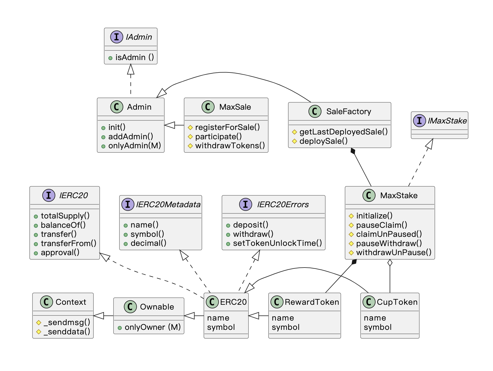

项目简介
stakeMax 是一个集合了 发币，质押，swap，kyc认证，借贷，跨链支持等多方功能的项目，供很多的同学进行学习以及初创团队进行参考

UML类图

各基本合约的介绍
合约接口 
IERC20.sol  openZeppelin 标准库接口，提供ERC20标准接口能力
IERC20Metadata.sol  openZeppelin 标准库接口，提供获取name,symbol,decimal能力
IMaxStake.sol  抽象质押合约，提供指定的方法供外部合约调用，deposit，withdraw，setUnLockTime
IAdmin.sol  权限接口，判断操作发起者是否是具有admin权限的角色
draft-IERC6093.sol  openZeppelin 标准库接口， 提供了公用的Event，Error

代币合约
ERC20.sol   本项目同质化代币的基本合约，提供公共的合约方法能力
RewardToken.sol   奖励合约，继承自ERC20合约，主要用于给质押合约提供质押奖励
CupToken.sol    茶杯合约（随便起名的），主要是提供给销售合约进行销售，以及用于在质押合约中创建流动性池子
SpoonToken.sol   勺子合约（随便起的名称），功能和 CupToken 类似，主要是验证多合约质押，swap的场景

逻辑控制合约
MaxStake.sol   质押合约，主要提供给外部用户质押能力，提取奖励，取回质押款项。以及初始化的一部分操作（资金注入，设置流动性池子）
MaxSale.sol   销售合约，由销售工厂合约创建，提供注册销售人员，客户购买Token，提取等等功能

工厂合约
SalesFactory.sol   用来批量创建销售，而非通过传统的部署方式获取销售合约

贡献
欢迎贡献代码！请遵循以下步骤：

联系方式  zhulida5555@gmail.com